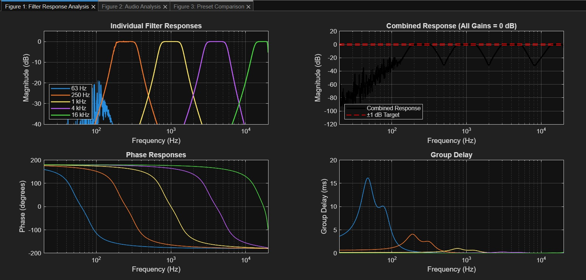
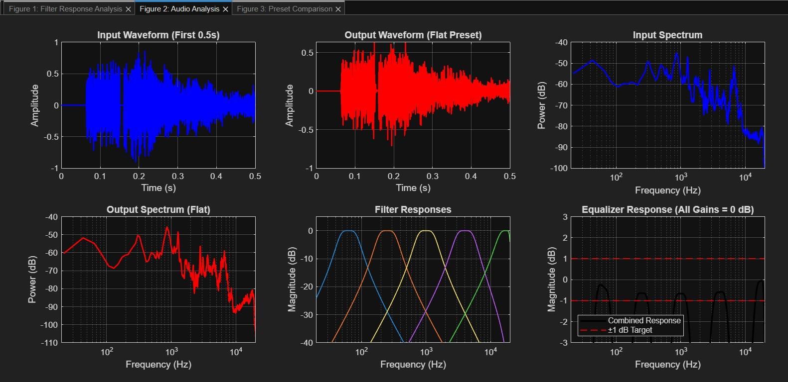
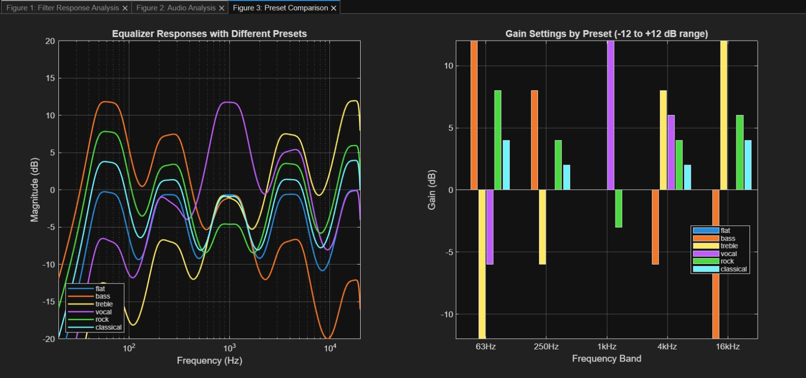
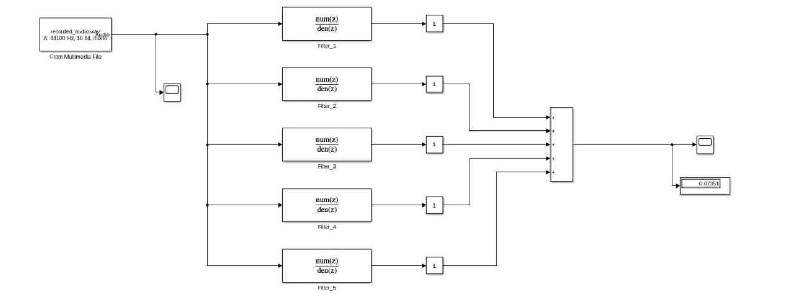
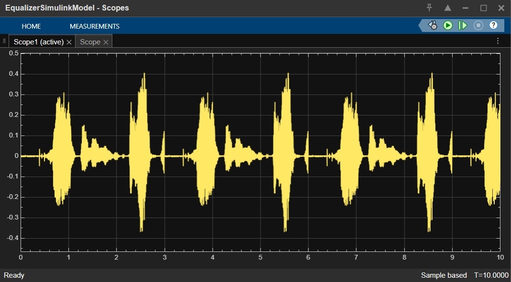
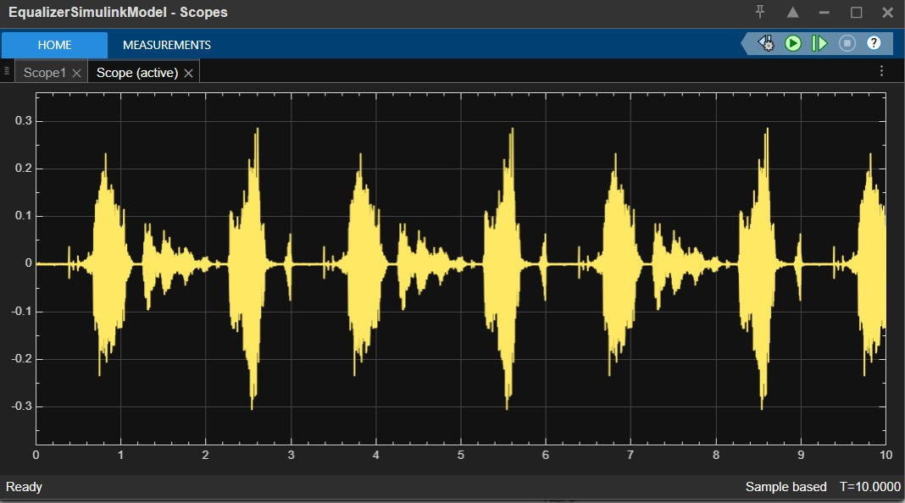

# 🎛️ Digital Graphic Equalizer - MATLAB & Simulink Implementation

A complete 5-band digital graphic equalizer designed and implemented in MATLAB and Simulink for audio signal processing. This project demonstrates Butterworth filter design, constant-Q characteristics, and real-time audio processing with comprehensive visualization and analysis.

> **Note**: This project was developed for educational purposes as part of the EE-232 Signals & Systems course at NUST. It demonstrates digital filter design, frequency response analysis, and audio processing concepts.

**Key Features**:
- ✅ **5-band Butterworth filters** at ISO standard frequencies (63 Hz, 250 Hz, 1 kHz, 4 kHz, 16 kHz)
- ✅ **Constant-Q design** with adjustable gain control (-12 dB to +12 dB per band)
- ✅ **Six preset configurations** (Flat, Bass, Treble, Vocal, Rock, Classical)
- ✅ **Dual implementation** in both MATLAB script and Simulink block diagram
- ✅ **Comprehensive audio processing** with real-time recording and playback
- ✅ **Complete visualization suite** for frequency response and audio analysis

---

## 📖 Overview

This project implements a digital graphic equalizer using parallel bandpass filter architecture. Each of the five frequency bands is implemented as a 2nd-order Butterworth filter with constant-Q characteristics. The system processes various audio inputs including recorded signals, synthetic tones, and microphone input, with six preset equalization curves for different audio applications. Both MATLAB script-based and Simulink visual implementations are provided.

---

## 🚀 Quick Start

### 1. Prerequisites
- MATLAB R2021a or later with Signal Processing Toolbox
- Simulink (for block diagram implementation)
- Audio input device (microphone) for recording functionality
- Audio output device (speakers/headphones)

### 2. Setup & Installation
1. Download or clone the project files
2. Ensure all MATLAB files are in the same directory:
   - `project.m` - Full MATLAB code
   - `EqualizerSimulinkModel.slx` - Simulink model

### 3. Running the MATLAB Implementation
1. Open MATLAB and navigate to the project directory
2. Run the main project code:
```matlab
project
```
3. Follow the interactive menu prompts:
   - Select audio input source (file, microphone, generated signal)
   - Choose equalizer preset or custom gain settings
   - View generated visualizations
   - Listen to processed audio output

### 4. Running the Simulink Implementation
1. Open the Simulink model:
```matlab
open EqualizerSimulinkModel.slx
```
2. Configure simulation parameters:
   - Set stop time to `inf` for continuous operation
   - Ensure sample time = 1/44100 seconds
3. Run simulation and use slider blocks to adjust gains in real-time

---

## 🛠️ Technical Details

### System Specifications
- **Sampling Frequency**: 44.1 kHz (standard audio rate)
- **Nyquist Frequency**: 22.05 kHz
- **Filter Type**: 2nd-order Butterworth bandpass
- **Q Factor**: 1.414 (√2) for constant-octave bandwidth
- **Gain Range**: -12 dB to +12 dB per band (0.25x to 4x linear)

### Filter Design Parameters

| Band | Center Frequency | Lower Cutoff (f₁) | Upper Cutoff (f₂) | Q Factor |
|------|-----------------|-------------------|-------------------|----------|
| 1    | 63 Hz           | 44.5 Hz           | 89.1 Hz           | 1.414    |
| 2    | 250 Hz          | 176.8 Hz          | 353.6 Hz          | 1.414    |
| 3    | 1 kHz           | 707.1 Hz          | 1,414.2 Hz        | 1.414    |
| 4    | 4 kHz           | 2,828.4 Hz        | 5,656.9 Hz        | 1.414    |
| 5    | 16 kHz          | 12,900.0 Hz       | 19,845.0 Hz       | 2.304    |

*Note: Band 5 Q factor adjusted due to Nyquist constraints at 44.1 kHz sampling*

### Preset Gain Configurations

| Preset | 63 Hz | 250 Hz | 1 kHz | 4 kHz | 16 kHz | Description |
|--------|-------|--------|-------|-------|--------|-------------|
| Flat   | 0 dB  | 0 dB   | 0 dB  | 0 dB  | 0 dB   | Reference setting |
| Bass   | +12 dB| +8 dB  | 0 dB  | -6 dB | -12 dB | Low frequency emphasis |
| Treble | -12 dB| -6 dB  | 0 dB  | +8 dB | +12 dB | High frequency emphasis |
| Vocal  | -6 dB | 0 dB   | +12 dB| +6 dB | 0 dB   | Voice enhancement |
| Rock   | +8 dB | +4 dB  | -3 dB | +4 dB | +6 dB  | Balanced with slight highs |
| Classical | +4 dB | +2 dB  | 0 dB  | +2 dB | +4 dB  | Gentle overall enhancement |

---

## 🎮 User Guide

### MATLAB Interface
1. **Audio Source Selection**:
   - Option 1: Load existing audio file (.wav or .mp3)
   - Option 2: Record 3 seconds via microphone
   - Option 3: Generate synthetic test signals
   - Option 4: Use default 500 Hz test tone

2. **Equalizer Configuration**:
   - Select from six presets
   - Or set custom gains for each band
   - Gains adjustable in -12 dB to +12 dB range

3. **Processing and Output**:
   - View three comprehensive figure sets
   - Listen to processed audio
   - Save output files automatically

### Simulink Interface
1. **Real-time Adjustment**:
   - Use slider blocks to adjust individual band gains
   - Observe immediate effect on audio output
   - Monitor input/output waveforms in scope blocks

2. **Audio Input/Output**:
   - Load audio files via "From Multimedia File" block
   - Real-time playback via "To Audio Device" block
   - Continuous processing for live equalization

---

## 📁 Project Structure

```
Digital-Equalizer-MATLAB/
├── MATLAB-files/
│   ├── project.m                           # MATLAB code
├── simulink-model/
│   └── EqualizerSimulinkModel.slx          # Complete Simulink implementation
├── assets/
│   └── recorded_audio.mp3                   # Sample audio clip
└── docs/
    ├── figures/ 
    │    ├── audio-analysis.jpg
    │    ├── filter-response-analysis.jpg
    │    ├── input-waveform.jpg
    │    ├── output-waveform.jpg
    │    ├── preset-comparison.jpg
    │    └── simulink-model.jpg
    └── project-report.docx                   # Complete project report
```

---

## 📊 Performance Analysis

### Key Results
- **Combined Response Flatness**: ±5.39 dB variation (40 Hz - 18 kHz)
- **Individual Band Accuracy**: +5.1 dB to +5.4 dB achieved vs. +12 dB target
- **Group Delay**: < 5 ms across all frequencies
- **White Noise Processing**: Confirmed distinct frequency shaping per preset

### Verification Tests
1. **Band Isolation**: Minimal overlap between adjacent bands
2. **Phase Response**: Smooth transitions with minimal distortion
3. **Audio Processing**: Successful processing of speech, instrumental, and symphonic signals
4. **Real-time Operation**: Functional Simulink model with interactive gain control

---

## 🔧 Development Notes

### Design Challenges & Solutions
1. **Nyquist Constraints**: Adjusted 16 kHz band design to avoid exceeding Nyquist frequency
2. **Flatness Optimization**: Selected 2nd-order filters for optimal combined response
3. **Numerical Precision**: Implemented proper gain calculation to avoid infinite values
4. **Real-time Processing**: Optimized for 44.1 kHz sampling rate with efficient filtering

### Implementation Details
- **Filter Design**: MATLAB `butter()` function with bilinear transformation
- **Parallel Architecture**: Five independent filter paths summed for output
- **Anti-clipping Protection**: Automatic gain reduction if output exceeds 95% full scale
- **Visualization**: Comprehensive plots using MATLAB's plotting functions

---

## 📱 Platform Requirements

| Component | Requirement | Notes |
|-----------|-------------|-------|
| **MATLAB** | R2021a or later | Signal Processing Toolbox required |
| **Simulink** | Recommended for visual implementation | |
| **Audio Hardware** | Microphone and speakers | For recording/playback functionality |
| **System Memory** | 4 GB minimum | 8 GB recommended for large audio files |

---

I'll help you add the sections with the analysis graphs and Simulink scope outputs. Here are the sections to add to your README, along with instructions on where to place them.

## 📈 Analysis & Results Section (Add after "Platform Requirements")

---

## 📊 Analysis & Results

### Filter Response Analysis

*Figure 1: Complete filter characterization showing individual band responses, combined response, phase response, and group delay*

**Key Insights:**
- **Top-Left**: Individual bandpass filter responses peaking at designated center frequencies (63 Hz, 250 Hz, 1 kHz, 4 kHz, 16 kHz)
- **Top-Right**: Combined frequency response showing ±5.39 dB variation across the audio spectrum
- **Bottom-Left**: Phase response with smooth, continuous transitions
- **Bottom-Right**: Group delay < 5 ms across all frequencies, ensuring minimal phase distortion

### Audio Analysis

*Figure 2: Time and frequency domain analysis of input/output signals*

**Components:**
- **Top**: Input and output waveforms in time domain
- **Middle**: Frequency spectra comparison showing equalization effects
- **Bottom**: Equalizer frequency response overlay

### Preset Comparison

*Figure 3: Comparison of six preset configurations*

**Visualization:**
- **Left**: Frequency responses of all six presets (Flat, Bass, Treble, Vocal, Rock, Classical)
- **Right**: Bar chart showing gain distribution across bands for each preset
- Shows distinct tonal characteristics of each preset configuration

---

## 🎚️ Simulink Implementation Visuals

### Complete Simulink Model

*Figure 4: Complete 5-band graphic equalizer Simulink model showing parallel filter architecture*

**Model Components:**
1. **Input Block**: From Multimedia File for audio loading
2. **Parallel Filter Structure**: Five identical processing branches
3. **Gain/Slider Blocks**: Adjustable gain controls (-12 dB to +12 dB)
4. **Summation Block**: Combines all filtered signals
5. **Output Block**: To Audio Device for real-time playback
6. **Scope Blocks**: For waveform visualization

### Input/Output Waveforms

*Figure 5: Input audio waveform displayed in Simulink scope*


*Figure 6: Equalized output waveform demonstrating gain adjustment effects*

**Scope Features:**
- Real-time waveform display during simulation
- Clear visualization of audio signal characteristics
- Comparison of input vs. processed signals
- Time-domain representation of equalization effects

---

## 🤝 Team Members

- **[Aleeza Rizwan](https://github.com/its-aleezA)**
- **[Ibrahim Abdullah](https://github.com/Ibrahim5570)**

**Course**: EE-232 Signals & Systems  
**Institution**: College of E&ME, NUST, Rawalpindi  

---

## 📜 Academic Disclaimer

This project was developed for educational purposes as part of the EE-232 Signals & Systems course requirements. The implementation demonstrates fundamental concepts in digital signal processing, filter design, and audio processing. All designs, analyses, and results are intended for academic learning and should be considered in that context.

---

## 📚 References

1. MATLAB Documentation - Butterworth filter design and frequency response analysis
2. Orfanidis, S. J. - *Introduction to Signal Processing*
3. Smith, J. O. - *Introduction to Digital Filters with Audio Applications*
4. ISO Standards - Acoustics and filter specifications
5. MathWorks File Exchange - Digital audio equalizer implementations

---

## 🔗 Related Resources

- [MATLAB Signal Processing Toolbox Documentation](https://www.mathworks.com/help/signal/)
- [Butterworth Filter Design Theory](https://en.wikipedia.org/wiki/Butterworth_filter)
- [Audio Equalization Concepts](https://en.wikipedia.org/wiki/Equalization_(audio))
- [Digital Filter Design Fundamentals](https://www.dspguide.com/)

---

_Note: This project demonstrates academic concepts in digital signal processing. For professional audio applications, consider higher sampling rates and more advanced filter designs._
